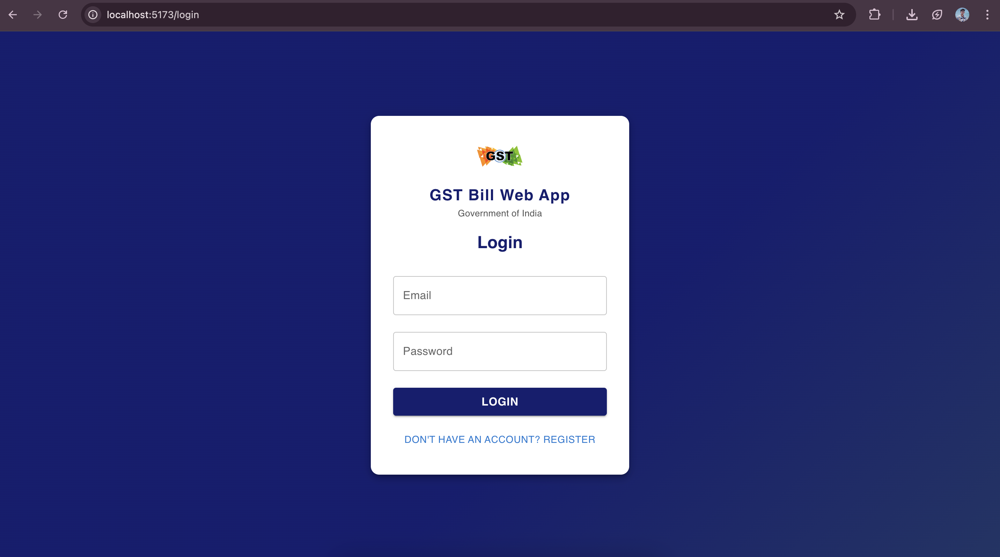
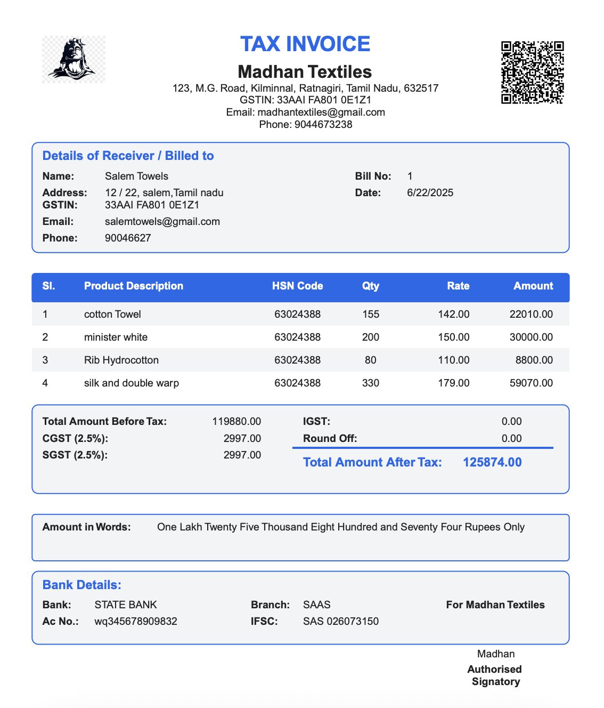
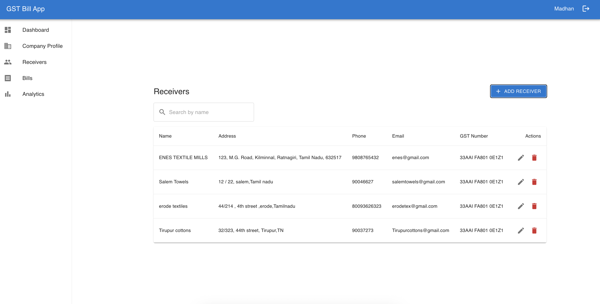
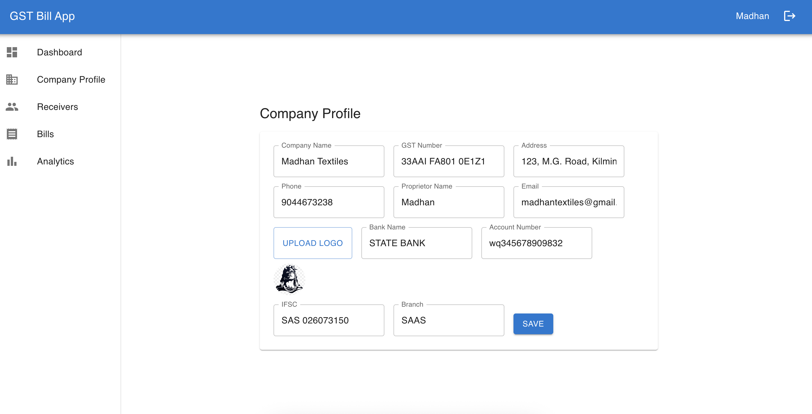
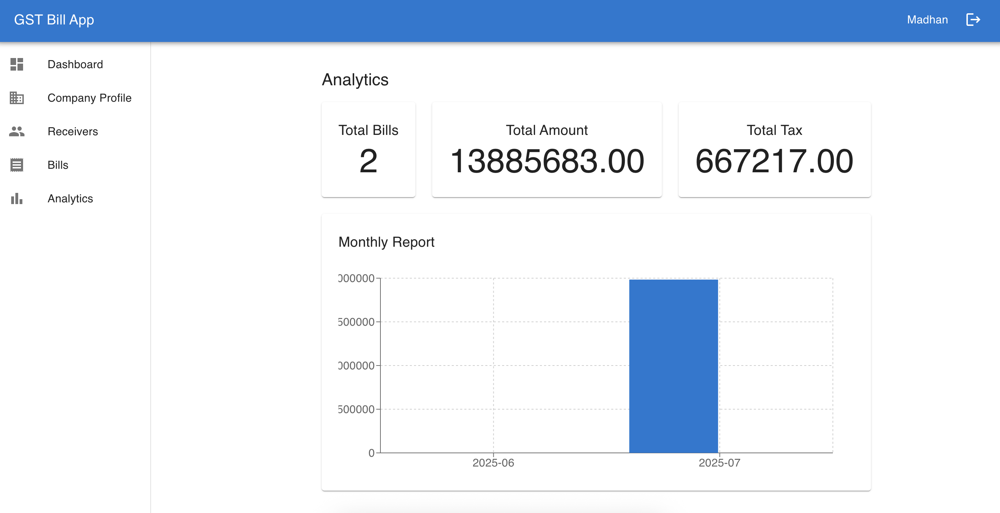

# 🧾 GST Bill WebApp

A modern, full-stack web application for generating, managing, and analyzing GST bills for businesses in India. Built with a robust backend and a beautiful, responsive frontend. 🚀

---

## 🚦 Tech Stack

<p align="left">
  
  
  
  
  
  
  
  
</p>

---

## ✨ Features

- 📊 **Dashboard**: View total bills, total amount, and total tax at a glance.
- 🧾 **Bill Management**: Create, edit, delete, and search GST bills with product and receiver details.
- 📥 **PDF Generation**: Download or view GST bills as professional PDFs.
- 🔍 **Analytics**: Get insights into your billing data.
- 🏢 **Company & Receiver Management**: Manage your company profile and receivers.
- 📦 **Product Management**: Add and manage products with HSN codes.
- 📱 **QR Code**: Each bill comes with a QR code for easy sharing and verification.
- 🔒 **Authentication**: Secure login and registration for users.

---

## 📂 Folder Structure

```
gstbill/
  backend/    # Node.js, Express, MongoDB API
  frontend/   # React, Vite, MUI frontend
```

---

## 🚀 Getting Started

### 1. Clone the repository
```bash
git clone https://github.com/madhan404/gst-bill-webapp.git
cd gst-bill-webapp
```

### 2. Setup Backend
```bash
cd backend
npm install
# Copy .env.example to .env and set your MongoDB URI and JWT secret
npm start
```

### 3. Setup Frontend
```bash
cd ../frontend
npm install
npm run dev
```

The backend runs on `http://localhost:5000` and the frontend on `http://localhost:5173` by default.

---

## 🖼️ Screenshots

### Login Page


### Bill Preview


### Receiver Details


### Company Profile


### Analytics


---

## 🤝 Contributing

Pull requests are welcome! For major changes, please open an issue first to discuss what you would like to change.

---

## 📄 License

This project is licensed under the MIT License.See the [LICENSE](LICENSE) file for details.
---

## 🙋‍♂️ Contact

Created by [@madhan404](https://github.com/madhan404) — feel free to reach out! 

## ❤️live preview : https://6859567b717bf20009f475c5--mellow-moxie-829df5.netlify.app/  <!-- Production only, use localhost for local dev -->
